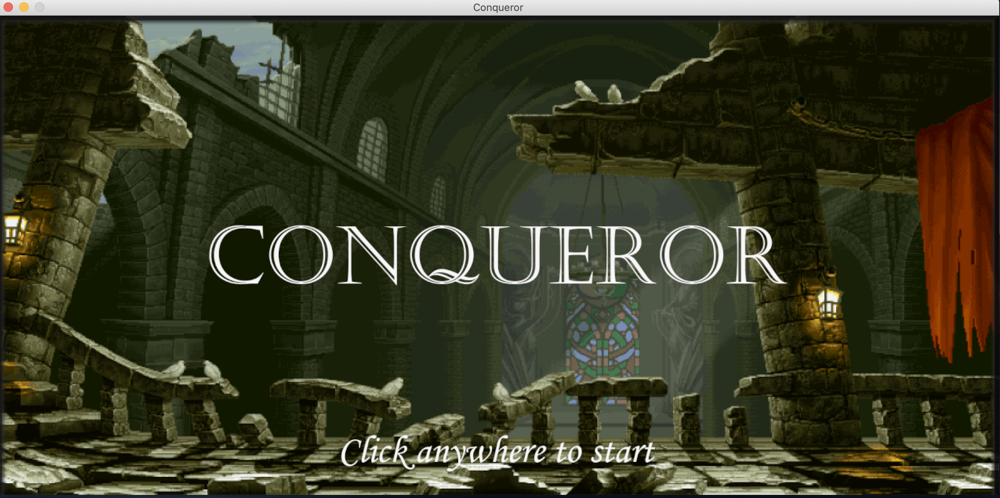
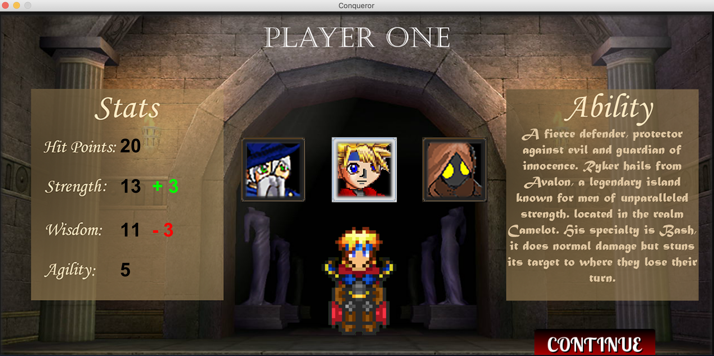
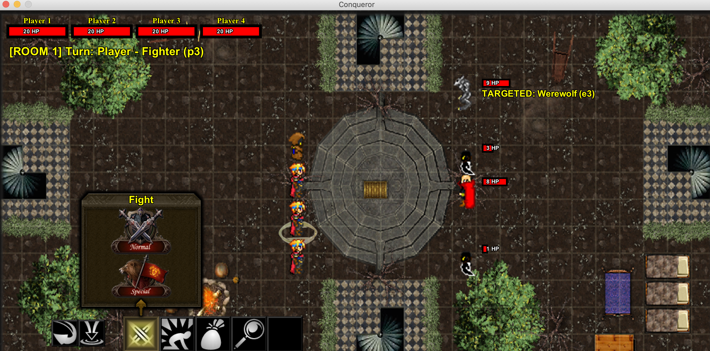

# AdventureRPGGame
Conqueror, the 4 player turn-based RPG! Grab your closest friends and choose between a wizard, fighter, or thief to navigate your way through a treacherous dungeon full of ghosts, goblins, werewolves and more! Each character has their own special abilities and contributions to the group so choose wisely so that you can make it to the end and get that loot you set out for. Good luck! 

Below are some screenshots of the game itself: 

The introduction screen: 

The character selection screen: 

Screenshot of gameplay: 

IMPORTANT! To run this game, download this file and any Java compiler such as NetBeans, Eclipse, etc. Below is a link to download the NetBeans IDE:

https://netbeans.org/downloads/8.0.2/
